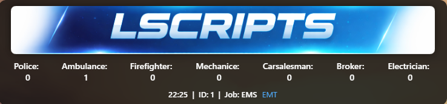

# LScripts Scoreboard for FiveM

A **modern, neon-style scoreboard** for ESX-based FiveM servers, designed to display player and server information in a clean and professional way. Fully responsive, customizable, and easy to use. Further publication is not allowed!

---

## 🎨 Features

- **Responsive Neon Banner** – Top banner scales with scoreboard width for a polished look.  
- **Player Info** – Shows Player ID, Job, and Job Grade in real-time.  
- **Server Info** – Displays server time, total players online, and faction counts (Police, Ambulance, Firefighter).  
- **Dynamic Updates** – Automatically updates when players change jobs or server data changes.  
- **Toggle Scoreboard** – `/scoreboard` command to display.  
- **Neon Glow Design** – Modern aesthetic with subtle animation effects.  
- **Multi-Faction Support** – Tracks multiple state factions with live counts.  
- **ESX Compatible** – Fully integrated with ESX jobs and player data.  

---

## ⚡ Installation

1. Place the resource folder in your server `resources` directory.  
2. Add the following line to your `server.cfg`:
    ```txt
    start lscripts_scoreboard
    ```
3. Make sure `es_extended` is installed and running.  
4. Optional: Replace `banner.png` with your own branding images.  

---

## 🕹 Commands

- `/scoreboard` – Toggle scoreboard visibility. 

---

## 🎛 Customization

- Modify `style.css` to change colors, fonts, or layout.  
- Replace `banner.png` for your server branding.  
- Adjust faction names and colors in the NUI files.  

---

## ✅ License

MIT License – Free to use and modify for your server.  

---

## 📸 Preview

  

---

## Discord - FAFS

https://discord.gg/jfUT9c2AdW

---

LScripts Scoreboard is designed to give players a **clean, modern interface** for seeing server info, jobs, and factions at a glance – while keeping your HUD lightweight and responsive. Further publication is not allowed!
